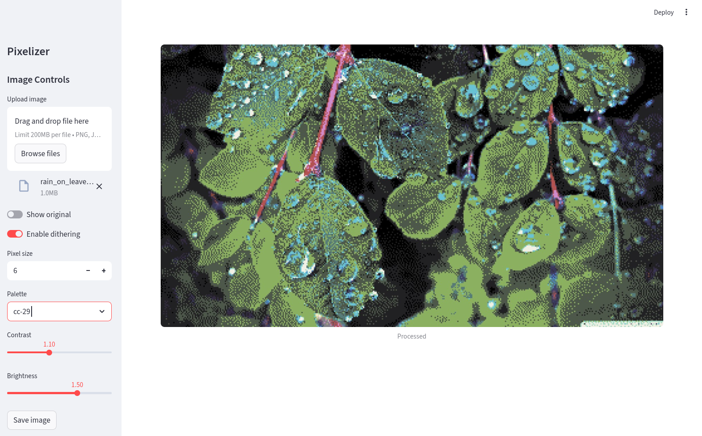
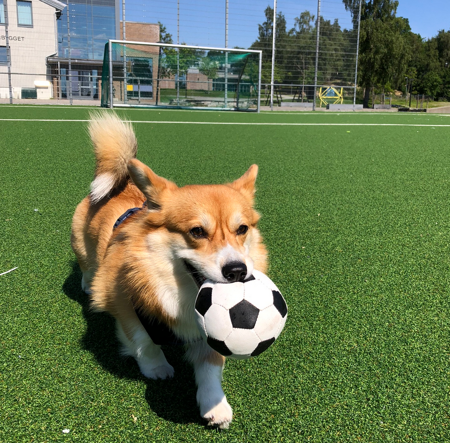
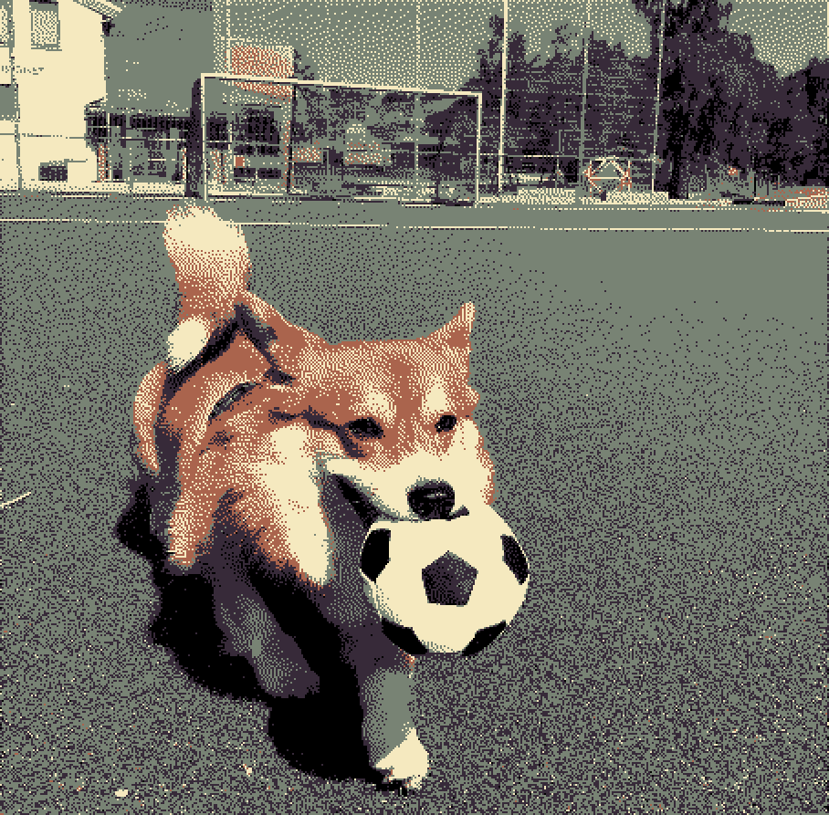
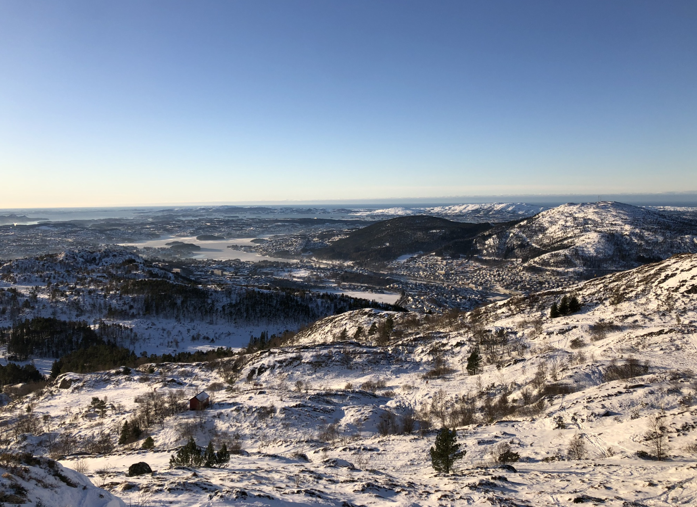
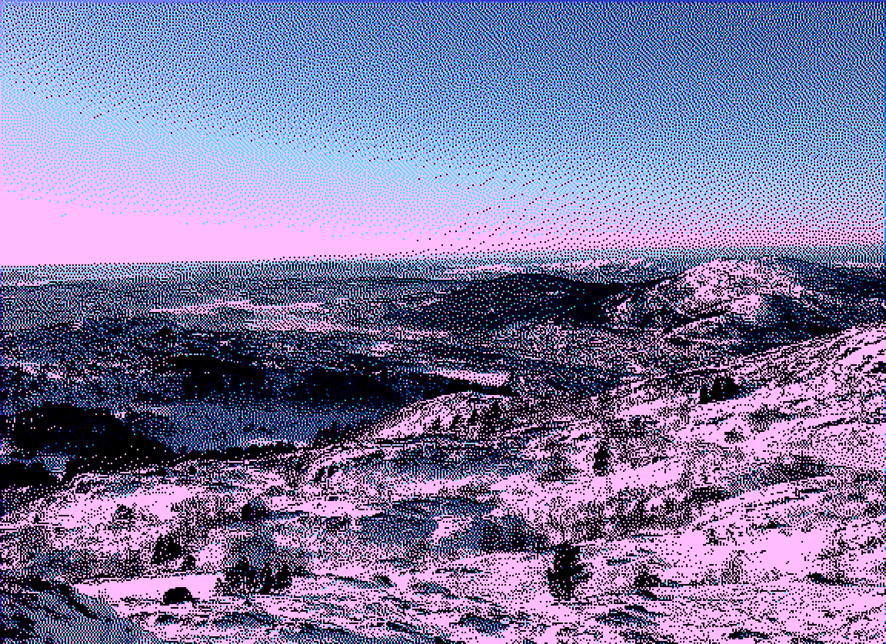
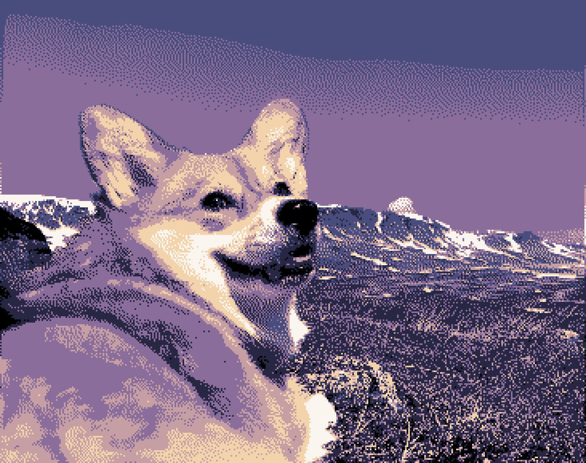
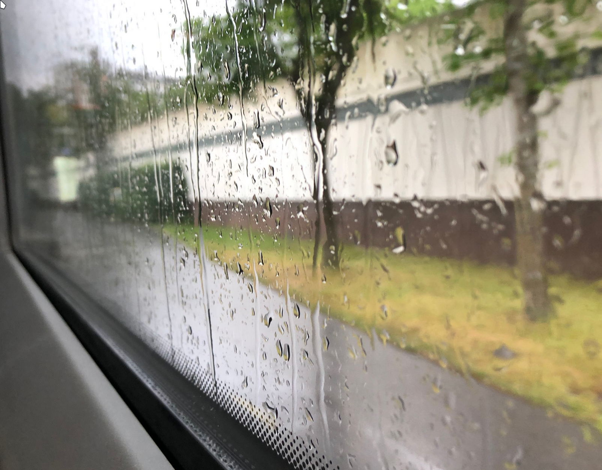
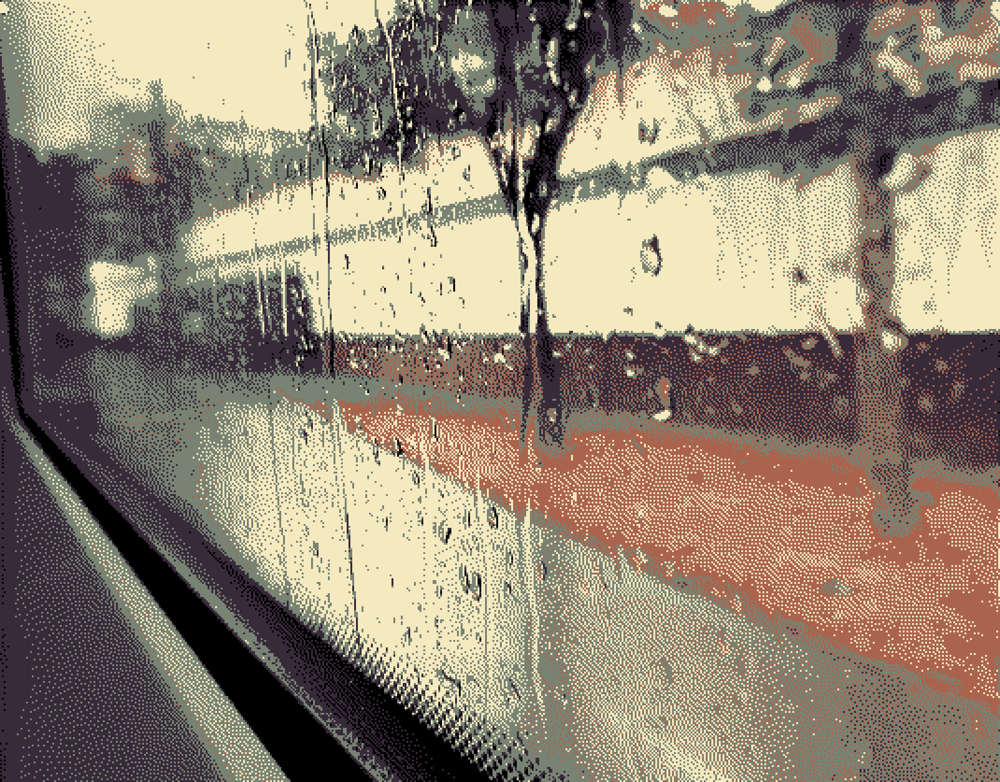
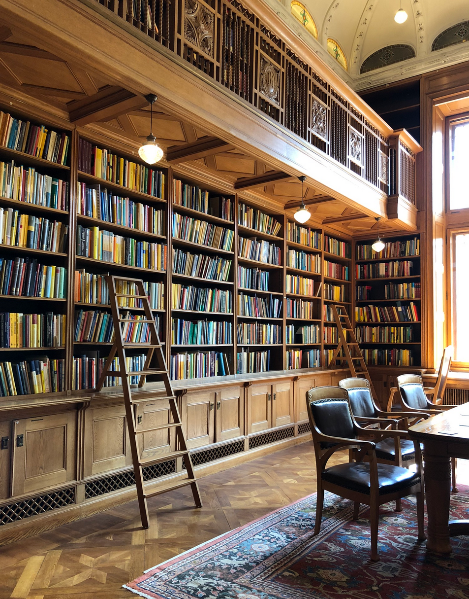
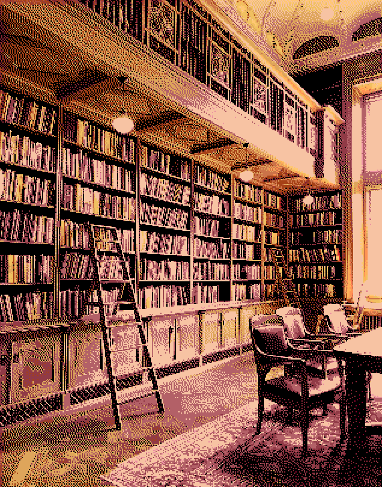

# pixelizer

A simple tool to create "pixel art" (not really pixel art, but pixelated images) from images. 



[Click here for live demo.](https://huggingface.co/spaces/odinhg/pixelizer)

## Features

- No AI
- Streamlit user interface
- Custom palettes (supports HEX files from Lospec.com)
- Dithering 

## Examples

| Original | Pixelized |
|----------|-----------|
|  |  |
|  |  |
|  |  |
|  |  |
|  |  |

## How to use (locally)

Using `uv`, simply run:

```bash
uv run streamlit run main.py
```

